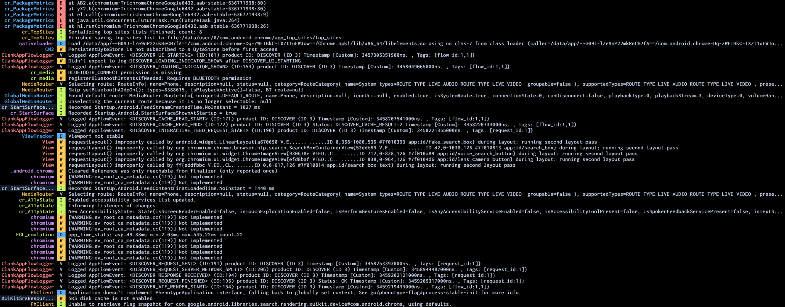

# pidcat
Makes `adb logcat` colored and adds the feature of being able to filter by app or tag. A Golang port~ of [github.com/JakeWharton/pidcat](https://github.com/JakeWharton/pidcat).



## Usage
```
Usage of pidcat:
      --adb-path string      path to the ADB binary
  -a, --all                  display messages from all packages
  -c, --clear                clear the log before running
      --current              filter by the current app only
  -d, --device               use the first device (adb -d)
  -e, --emulator             use the first emulator (adb -e)
  -f, --filter-tag strings   ignore specific tag(s)
      --list-all-packages    list all package names
      --list-packages        list all third party package names
  -L, --log-file string      write logcat output to file (level:tag:message)
  -m, --match-tag strings    filter by specific tag(s)
  -l, --min-level string     minimum log level to be displayed (V,D,I,W,E,F) (default "V")
  -p, --package strings      application package name(s)
  -s, --serial string        device serial number (adb -s)
```

## Installation

### Binaries

Download the prebuilt binaries [here](https://github.com/rtfmkiesel/pidcat/releases).

### Using Go

If you have Go installed, run `go install github.com/rtfmkiesel/pidcat/cmd/pidcat@latest`.

### Build from source

```sh
git clone https://github.com/rtfmkiesel/pidcat
cd pidcat
go build -o pidcat -ldflags="-s -w" ./cmd/pidcat/pidcat.go
```

## How does this work?

In the background, `adb shell ps` is used to get the PIDs of the wanted packages. In the `adb logcat` output, the lines/entries have a PID assigned to them. That's enough to apply a filter.